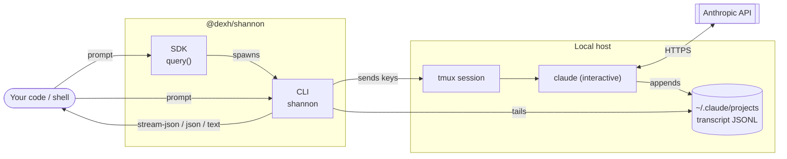

# Shannon

Shannon is a CLI and SDK wrapper around the interactive Claude Code CLI. It runs a real `claude` session inside tmux, sends a prompt, and emits stream JSON.



The dashed-style boundary: Shannon never calls the Anthropic API directly — it drives a real `claude` session and reads its on-disk transcript. `claude -p` is not used internally.

## Requirements

- [Bun](https://bun.sh)
- `claude` on `PATH`
- `tmux` on `PATH`
- A working Claude Code login

## CLI

Run without installing:

```sh
npx @dexh/shannon -p "Reply with exactly: hello" --output-format=stream-json --verbose
```

Or install globally:

```sh
npm install -g @dexh/shannon
shannon -p "Reply with exactly: hello" --output-format=stream-json --verbose
```

Output formats: `stream-json` (JSONL), `json` (single array), `text` (final result text).

## SDK

```sh
npm install @dexh/shannon
```

```ts
import { query } from "@dexh/shannon";

for await (const message of query({
  prompt: "Reply with exactly: hello",
  options: { outputFormat: "stream-json", verbose: true },
})) {
  console.log(JSON.stringify(message));
}
```

Async input is also accepted for finite user-message streams:

```ts
import { query, type ShannonUserMessage } from "@dexh/shannon";

async function* messages(): AsyncIterable<ShannonUserMessage> {
  yield {
    type: "user",
    message: {
      role: "user",
      content: [{ type: "text", text: "Reply with exactly: hello" }],
    },
    parent_tool_use_id: null,
    session_id: "",
  };
}

for await (const message of query({ prompt: messages() })) {
  console.log(JSON.stringify(message));
}
```

Pass an `AbortController` in options to terminate the underlying Shannon subprocess.

## Agent SDK facade

`@dexh/shannon-agent-sdk` is a Claude Agent SDK-compatible facade that re-exports Shannon's SDK surface. Full parity is a work in progress (see `GOAL_PROGRESS.md`).

```sh
npm install @dexh/shannon-agent-sdk
```

```ts
import { query } from "@dexh/shannon-agent-sdk";

for await (const message of query({
  prompt: "Reply with exactly: hello",
  options: { outputFormat: "stream-json", verbose: true },
})) {
  console.log(JSON.stringify(message));
}
```

## Development

```sh
bun install
bun test
bun run typecheck
bun ./index.ts -p "hello" --output-format=stream-json --verbose
```
